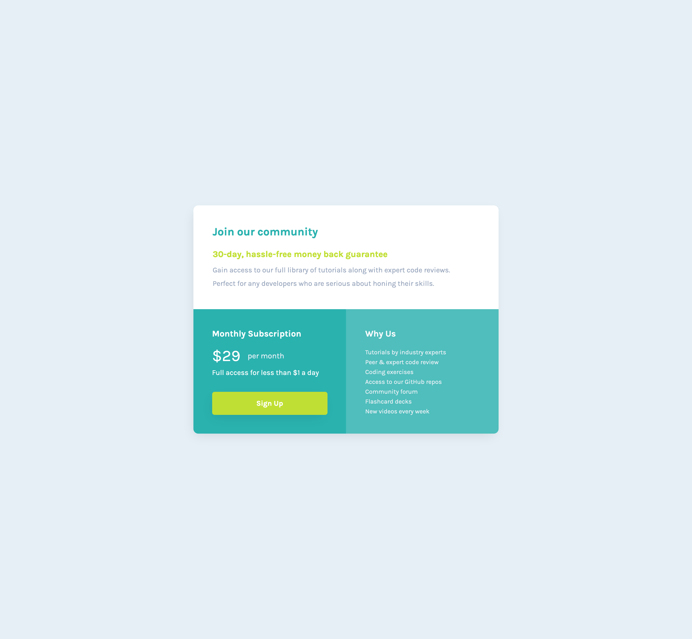

# Frontend Mentor - Single price grid component solution

This is a solution to the [Single price grid component challenge on Frontend Mentor](https://www.frontendmentor.io/challenges/single-price-grid-component-5ce41129d0ff452fec5abbbc). Frontend Mentor challenges help you improve your coding skills by building realistic projects. 

## Table of contents

- [Overview](#overview)
  - [The challenge](#the-challenge)
  - [Screenshot](#screenshot)
  - [Links](#links)
- [My process](#my-process)
  - [Built with](#built-with)
  - [What I learned](#what-i-learned)
  - [Useful resources](#useful-resources)
- [Author](#author)

## Overview

### The challenge

Users should be able to:

- View the optimal layout for the component depending on their device's screen size
- See a hover state on desktop for the Sign Up call-to-action

### Screenshot




### Links

- Solution URL: [https://github.com/hkparkjs/single-price-grid-component](https://github.com/hkparkjs/single-price-grid-component)
- Live Site URL: [https://park-single-price-grid-component.netlify.app/](https://park-single-price-grid-component.netlify.app/)

## My process

### Built with

- Semantic HTML5 markup
- CSS custom properties
- Flexbox
- CSS Grid

### What I learned
 - How to apply css grid layout (for desktop)

```css
.container {
    display: grid;
    grid-template-columns: repeat(2, 1fr);
    grid-template-rows: repeat(2, 1fr);
    (...)
  }

  .intro {
    display: grid;
    grid-column-start: 1;
    grid-column-end: 3;
    grid-row-start: 1;
    grid-row-end: 2;
    grid-template-rows: 93px 17px 77px;
    (...)
  }

  .subscription {
    display: grid;
    grid-column-start: 1;
    grid-column-end: 2;
    grid-row-start: 2;
    grid-row-end: 3;
    grid-template-rows: 71px 52px 49px;
    (...)
  }

  .benefit {
    display: grid;
    grid-column-start: 2;
    grid-column-end: 3;
    grid-row-start: 2;
    grid-row-end: 3;
    grid-template-rows: 82px 52px;
    (...)
  }
```

### Useful resources

- [MDN CSS Grids layout](https://developer.mozilla.org/en-US/docs/Learn/CSS/CSS_layout/Grids) - This helped me for setting Grid layout.

## Author

- Frontend Mentor - [@hkparkjs](https://www.frontendmentor.io/profile/hkparkjs)
